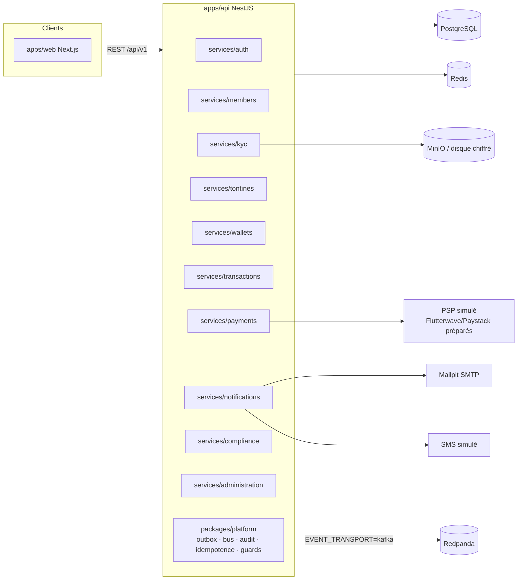

# Architecture

## 1. Vue d'ensemble

Monolithe modulaire NestJS (`apps/api`) + frontend Next.js (`apps/web`), dans un monorepo pnpm/Turborepo. Chaque domaine métier est un **package isolé** sous `services/*` exposant un module NestJS. Les domaines ne partagent ni tables ni services internes : ils communiquent par

1. **ports synchrones** explicites (interfaces exportées par le package, ex. `WalletLedgerPort`) lorsque la cohérence transactionnelle l'exige ;
2. **événements versionnés** publiés via un **outbox transactionnel** et consommés par des **consommateurs idempotents**.

Cette discipline permet d'extraire plus tard un domaine en microservice : un port devient un appel HTTP/gRPC, l'outbox publie déjà vers Kafka/Redpanda.



## 2. Structure du dépôt

```
apps/
  api/                 Hôte NestJS : bootstrap, Swagger, santé, métriques, planificateur
  web/                 Next.js App Router, Tailwind, composants shadcn/ui
packages/
  config/              Schéma d'environnement (zod) et chargement
  contracts/           Schémas zod partagés web/api, énumérations, argent, pays, erreurs
  events/              Enveloppe d'événement, catalogue versionné des payloads
  auth/                Primitives crypto (bcrypt, SHA-256, OTP, TOTP, JWT RS256), politique RBAC
  database/            Schéma Prisma, migrations SQL, client, seed
  platform/            Noyau NestJS transverse (Prisma, outbox, bus, idempotence, audit,
                       corrélation, gardes, filtres d'erreurs, KV Redis, horloge, jobs)
  ui/                  Composants UI partagés (style shadcn/ui)
  eslint-config/       Configuration ESLint partagée
  typescript-config/   tsconfig de base (strict)
services/
  auth/ members/ kyc/ tontines/ wallets/ transactions/
  payments/ notifications/ compliance/ administration/
infrastructure/
  docker/              Dockerfiles
  monitoring/          Prometheus, Grafana, OpenTelemetry collector
  scripts/             Scripts utilitaires (génération de clés, vérif. secrets…)
docs/
```

> `packages/platform` n'était pas listé dans la structure recommandée ; il est ajouté pour éviter que le code transverse (outbox, idempotence, audit) soit dupliqué dans chaque domaine.

## 3. Graphe de dépendances autorisé

Les dépendances entre domaines sont **acycliques** et limitées aux ports publics (`src/index.ts`) :

```
platform ← tous
notifications  (feuille : consomme des événements, expose NotificationPort)
compliance     → (aucun domaine)
members        → notifications
auth           → notifications
wallets        → compliance
transactions   → wallets, compliance
kyc            → members (port lecture profil), notifications
payments       → transactions, compliance, notifications
tontines       → transactions, wallets, members, compliance, notifications
administration → auth, members, tontines, transactions, payments, notifications
```

Règle vérifiée par ESLint (`import/no-restricted-paths`) : aucun import d'un chemin interne d'un autre package.

## 4. Données

Une seule base PostgreSQL en MVP, un **schéma logique par domaine** matérialisé par le préfixe des tables et par la règle « seul le domaine propriétaire écrit ses tables ». Les jointures inter-domaines en SQL sont interdites hors du module `reports` de `administration`, qui utilise des requêtes en lecture seule (A-28).

Voir `docs/domain-model.md`.

## 5. Flux transverses

### 5.1 Requête HTTP

`CorrelationMiddleware` (x-correlation-id) → `JwtAuthGuard` → `RolesGuard` → garde de propriété (`@OwnsResource`, `TontineAccessService`) → `ZodValidationPipe` → contrôleur → service de domaine → `$transaction` Prisma (écriture métier + audit + outbox) → réponse. Les erreurs sont normalisées par `ProblemDetailsFilter` (RFC 9457).

### 5.2 Événements

```
Service ──(même transaction SQL)──► outbox_events
OutboxRelay (poll 250 ms, FOR UPDATE SKIP LOCKED)
   ├─ EVENT_TRANSPORT=inprocess → EventDispatcher → handlers
   └─ EVENT_TRANSPORT=kafka     → Redpanda topic <eventType> → KafkaConsumer → handlers
Handler : insert processed_events(consumer, event_id) ON CONFLICT DO NOTHING
          → si déjà présent : ignoré (idempotence)
```

Retry avec backoff exponentiel ; après `maxAttempts`, l'événement passe en `DEAD` (DLQ consultable par le super-admin).

### 5.3 Opération financière

Voir `docs/domain-model.md` §Grand livre. Toute écriture monétaire passe par `LedgerService.post()` (package `wallets`) qui :

1. verrouille les wallets concernés par ordre d'identifiant croissant (`FOR UPDATE`) ;
2. vérifie statut, devise, solde disponible ;
3. insère les écritures (somme débits = somme crédits) ;
4. met à jour les soldes projetés avec contrôle de version ;
5. écrit les événements dans l'outbox ;
   le tout en isolation `SERIALIZABLE` avec retry borné (3) sur conflit `40001`.

### 5.4 Tâches planifiées

`@nestjs/schedule` déclenche des jobs idempotents (expiration des holds, démarrage des tontines, retards, rappels, expiration KYC, réconciliation, expiration des demandes d'accès, relais outbox). Chaque job est aussi exécutable à la demande par le super-admin (`POST /api/v1/admin/jobs/{name}/run`) pour les démonstrations et les tests E2E.

## 6. Fournisseurs externes (tous simulés)

| Interface                                                                | Adaptateur local                                                                | Adaptateurs préparés                                                                              |
| ------------------------------------------------------------------------ | ------------------------------------------------------------------------------- | ------------------------------------------------------------------------------------------------- |
| `DocumentStorage`                                                        | disque chiffré / MinIO                                                          | S3                                                                                                |
| `OcrProvider`, `FaceMatchProvider`, `BiometricIndex`, `LivenessProvider` | simulés déterministes                                                           | Smile Identity / Onfido                                                                           |
| `AmlScreeningProvider` (sanctions + PEP)                                 | liste de test embarquée                                                         | —                                                                                                 |
| `PaymentProvider`                                                        | `SimulatedPsp` (mobile money, carte, retrait, remboursement, webhooks, relevés) | `FlutterwaveProvider`, `PaystackProvider` (squelettes non câblés, lèvent `ProviderDisabledError`) |
| `SmsProvider`                                                            | simulé (table + logs)                                                           | Twilio / Africa's Talking                                                                         |
| `EmailProvider`                                                          | SMTP (Mailpit)                                                                  | SendGrid                                                                                          |
| `CaptchaVerifier`, `GeoIpResolver`, `FraudScoringPort`                   | simulés                                                                         | hCaptcha, MaxMind                                                                                 |

Le comportement des simulateurs est **déterministe** (dérivé des entrées) afin que les tests soient reproductibles. Exemple : un selfie dont l'empreinte contient `facematch:72` produit un score de 72 %.

## 7. Observabilité

- Logs JSON (pino) avec `correlationId`, `userId`, `route`, masquage des champs sensibles.
- OpenTelemetry (traces HTTP + Prisma) exporté vers le collector si `OTEL_EXPORTER_OTLP_ENDPOINT` est défini.
- `/metrics` Prometheus : latences HTTP, événements outbox en attente / morts, holds actifs, jobs.
- Grafana provisionné avec un tableau de bord de base (`infrastructure/monitoring`).

## 8. Extraction future en microservices

| Aujourd'hui                               | Demain                                                                                             |
| ----------------------------------------- | -------------------------------------------------------------------------------------------------- |
| Port synchrone TypeScript                 | Client HTTP/gRPC généré depuis le contrat                                                          |
| Outbox → dispatcher in-process            | Outbox → Redpanda (déjà supporté)                                                                  |
| Tables préfixées dans une base            | Base dédiée par service                                                                            |
| Transaction SQL englobant wallet + ledger | Inchangé (même service `wallets`) ; les autres domaines utilisent déjà des sagas avec compensation |
