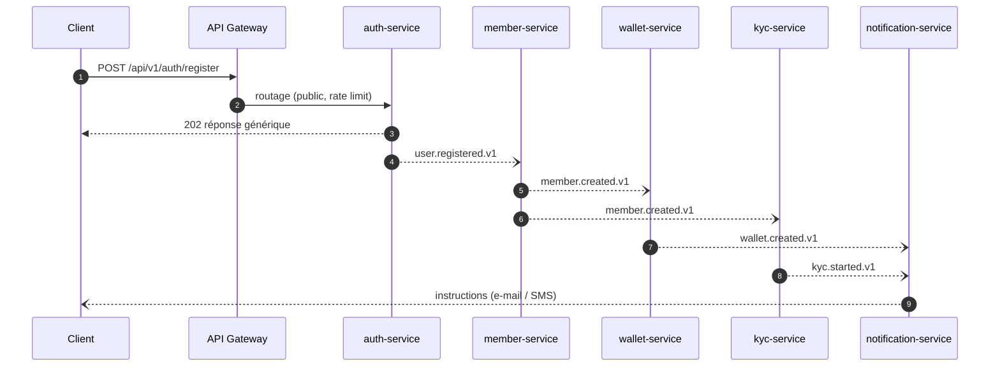
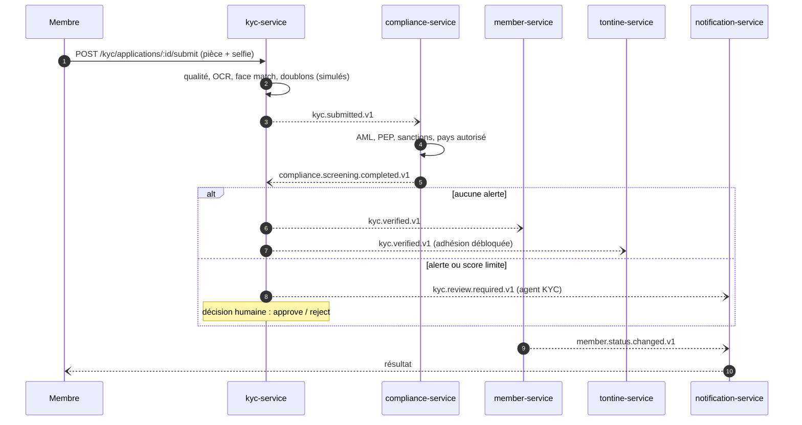
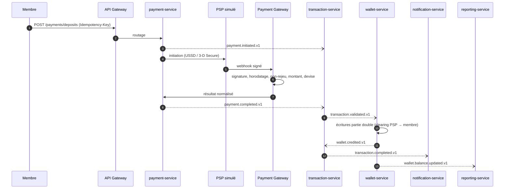
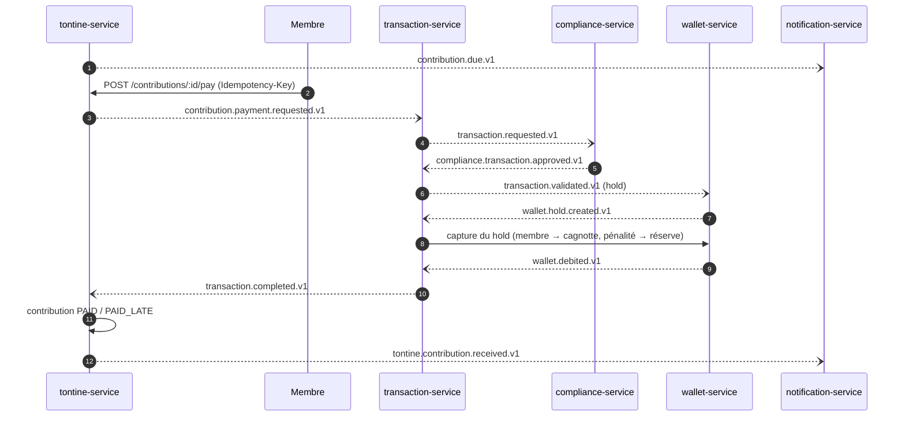
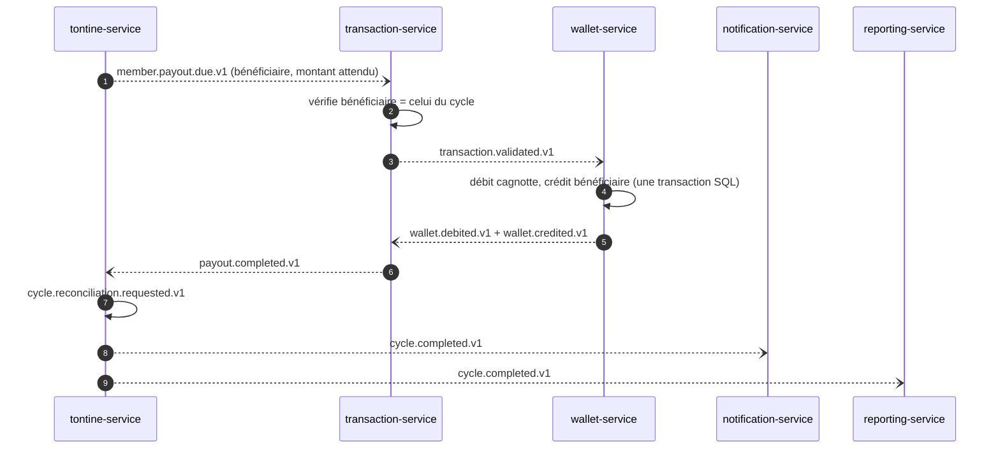
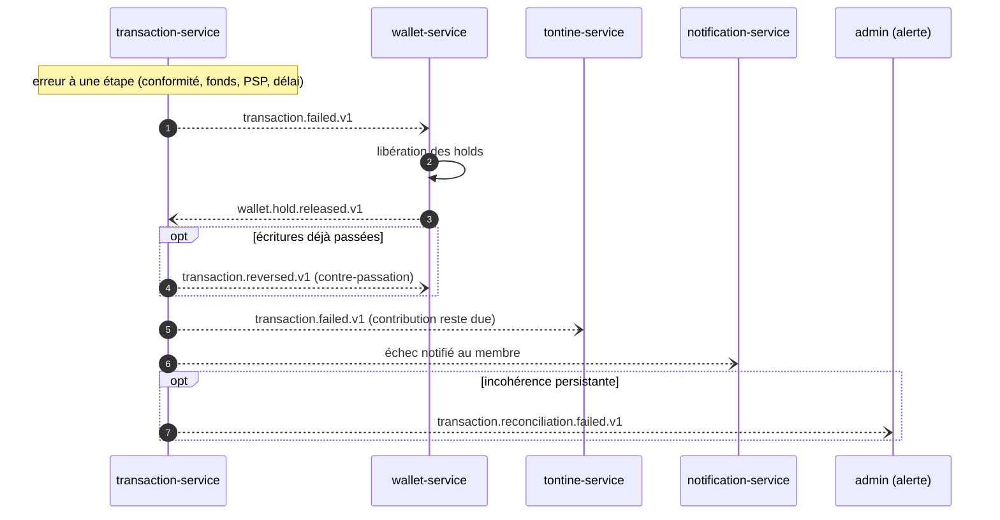
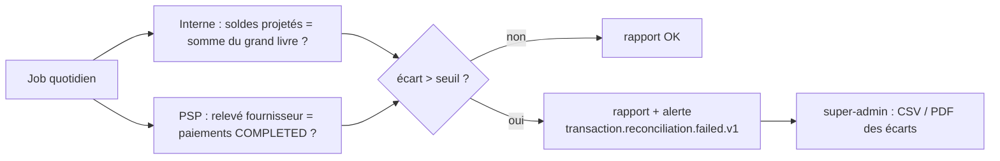

# Sagas et flux interservices

Diagrammes de l'état **cible** (docs/extraction-plan.md, étapes 5 à 7). Sous chaque diagramme, « Aujourd'hui » décrit l'implémentation actuelle du monolithe modulaire. Les noms d'événements cibles portent le suffixe de version du topic (`.v1`) ; la version est aussi dans l'enveloppe (`eventVersion`).

Règles communes : chaque étape écrit son état et ses événements dans **la même transaction SQL** (outbox) ; chaque consommateur est **idempotent** (inbox `processed_events`) ; aucune transaction ACID ne traverse deux services ; toute étape financière a une **compensation**.

## 1. Inscription

Aujourd'hui : `user.registered` → profil membre → `member.created` → wallet créé dès que le pays est connu. Le dossier KYC est ouvert à la première soumission du membre (pas d'événement `kyc.started`).

## 2. KYC

Aujourd'hui : le screening AML/PEP/sanctions est une étape du pipeline KYC (fournisseur simulé) ; les correspondances ouvrent un dossier de conformité (`kyc.aml.match`).

## 3. Dépôt

Aujourd'hui : webhook reçu par `payments` (`/payments/webhooks/:provider`), puis `payment.completed` → consommateur `settle()` qui appelle `TransactionsService.execute()` en synchrone.

## 4. Contribution

Aujourd'hui : `ContributionsService.pay()` crée le hold et appelle `TransactionsService.execute()` (conformité, capture) en synchrone, sous un verrou par échéance ; en cas d'échec le hold est libéré.

## 5. Paiement du bénéficiaire

Aujourd'hui : `PayoutsService.payout()` exécute la transaction `PAYOUT` en synchrone quand la collecte est complète, puis publie `tontine.payout.initiated` et `tontine.cycle.completed`. `member.payout.due` est déjà publié à l'ouverture du cycle.

## 6. Compensation

Aujourd'hui : holds libérés en cas d'échec (`releaseHold`), contre-passation `REVERSAL` par `TransactionsService.reverse()`, remboursement PSP avec reversement interne, holds expirés par job.

## 7. Réconciliation

Aujourd'hui : `InternalReconciliationService` et `PspReconciliationService`, rapports `trx_reconciliation_reports`, événement `reconciliation.completed`, déclenchement via `/admin/reconciliation/run` ou `/payments/reconcile`.
