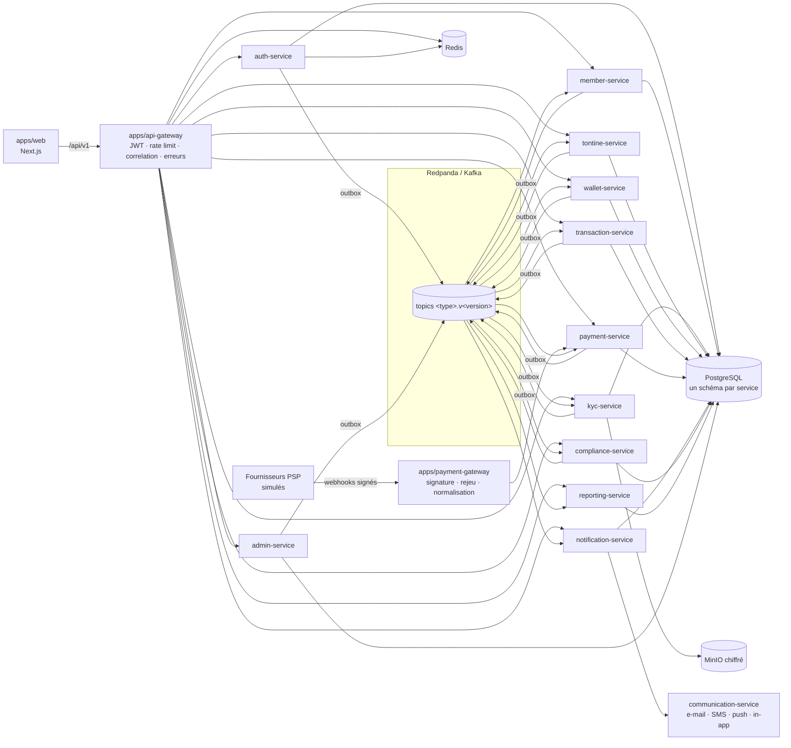

# Carte des services

État cible de l'extraction (docs/extraction-plan.md). Tant qu'un service n'est pas extrait, il tourne comme module de `apps/api` ; le gateway le route de la même façon.

## 1. Architecture générale



## 2. Dépendances interservices

Flèche pleine : appel synchrone autorisé (lecture courte, validation de jeton). Flèche pointillée : événement.

```mermaid
flowchart TB
  GW[api-gateway] -->|JWKS| AUTH[auth]
  AUTH -.user.registered.-> MEM[member]
  MEM -.member.created.-> WAL[wallet]
  MEM -.member.created.-> KYC[kyc]
  KYC -.kyc.submitted.-> CMP[compliance]
  CMP -.compliance.screening.completed.-> KYC
  KYC -.kyc.verified / rejected.-> MEM
  KYC -.kyc.verified.-> TON[tontine]
  PAY[payment] -.payment.completed / failed.-> TRX[transaction]
  TON -.contribution.payment.requested<br/>member.payout.due.-> TRX
  TRX -.transaction.requested.-> CMP
  CMP -.compliance.transaction.approved / blocked.-> TRX
  TRX -.transaction.validated / reversed.-> WAL
  WAL -.wallet.debited / credited / hold.-> TRX
  TRX -.transaction.completed / failed<br/>payout.completed / failed.-> TON
  TRX & WAL & TON & KYC & MEM & PAY -.-> NOT[notification]
  TRX & WAL & TON & KYC & CMP & PAY -.-> REP[reporting]
  NOT -.communication.requested.-> COM[communication]
```

## 3. Responsabilités

| Service               | Package actuel                      | Responsabilités                                                                        | Tables (schéma cible)              |
| --------------------- | ----------------------------------- | -------------------------------------------------------------------------------------- | ---------------------------------- |
| api-gateway           | — (étape 1)                         | Routage, JWT, rate limiting, correlation ID, erreurs, versionnement                    | aucune                             |
| payment-gateway       | — (étape 2)                         | Réception et vérification des webhooks, normalisation                                  | `pgw` (journal des webhooks reçus) |
| auth-service          | `services/auth`                     | Inscription, connexion, OTP, MFA, sessions, refresh rotatif, verrouillage              | `auth`                             |
| member-service        | `services/members`                  | Profil, préférences, statut, suspension, historique                                    | `member`                           |
| kyc-service           | `services/kyc`                      | Dossiers, documents chiffrés, OCR / face match simulés, doublons, revue, expiration    | `kyc`                              |
| compliance-service    | `services/compliance`               | Règles, AML / PEP / sanctions, score de risque, dossiers, fraude                       | `compliance`                       |
| tontine-service       | `services/tontines`                 | Tontines, invitations, cycles, contributions, pénalités, bénéficiaires, clôture        | `tontine`                          |
| wallet-service        | `services/wallets`                  | Wallets, grand livre en partie double, holds, capture, reversal                        | `wallet`                           |
| transaction-service   | `services/transactions`             | Orchestration des sagas, machine à états, réconciliation interne                       | `transaction`                      |
| payment-service       | `services/payments`                 | Dépôts, retraits, remboursements, fournisseurs, réconciliation PSP                     | `payment`                          |
| notification-service  | `services/notifications`            | Quoi envoyer, à qui, selon les préférences                                             | `notification`                     |
| communication-service | `services/communication` (étape 8c) | Comment envoyer : adresse, fournisseurs, limite anti-spam, journal de livraison (A-51) | `communication`                    |
| reporting-service     | `services/reporting` (étape 6 ✅)   | Projections alimentées par les instantanés d'état (A-54), rapports, tableau de bord    | `reporting`                        |
| admin-service         | `services/administration`           | Tableau de bord, configurations, administrateurs, audit                                | `admin`                            |

Détail des tables : `docs/data-ownership.md`. Événements : `docs/event-catalog.md`. Sagas : `docs/sagas.md`.
