# Plan du site

Légende : ✅ existant (thème de la charte appliqué au lot 1) · 🔄 refonte prévue (lot indiqué) · 🆕 nouveau.

```mermaid
flowchart TD
  ROOT["/"] --> PUB["Public"]
  ROOT --> APP["Espace connecté"]
  PUB --> P1["/ Bienvenue ✅ L2"]
  PUB --> P2["/request-account Inscription ✅ L2"]
  PUB --> P3["/activate, /activate/:token : OTP + mot de passe ✅ L2"]
  PUB --> P4["/login ✅ L2"]
  PUB --> P5["/forgot-password, /reset-password/:token ✅ L2"]
  PUB --> P6["/invitations/:code ✅ L3"]
  APP --> M1["/dashboard Accueil ✅ L3"]
  APP --> M2["/tontines, /tontines/:id, /tontines/new ✅ L3"]
  APP --> M3["/wallet (+ dépôt, retrait) ✅ L4"]
  APP --> M4["/kyc ✅ L4"]
  APP --> M5["/notifications ✅ L4"]
  APP --> M6["/profile, /security ✅ L4"]
  APP --> M7["/reporting 🆕 L1"]
  APP --> A1["/tontines/:id/admin (tableau de bord, membres, paramètres) ✅ L5"]
  APP --> A2["/admin (tableau global, tontines, utilisateurs, membres, conformité, incidents, audit) ✅ L5"]
  APP --> A3["/kyc-review/* — thème L1, textes FR"]
  ROOT --> DEV["/dev/ui-kit 🆕 L1 · /dev/messages"]
```

## Routes détaillées

| Route                                        | Écran                                                                               | Lot  |
| -------------------------------------------- | ----------------------------------------------------------------------------------- | ---- |
| `/`                                          | Bienvenue — « Épargnez ensemble, en toute confiance »                               | 2    |
| `/request-account`                           | Inscription (demande de compte)                                                     | 2    |
| `/activate/:token`                           | Activation : OTP, création du mot de passe                                          | 2    |
| `/login`                                     | Connexion (e-mail ou téléphone, se souvenir de moi, MFA)                            | 2    |
| `/forgot-password`, `/reset-password/:token` | Mot de passe oublié                                                                 | 2    |
| `/dashboard`                                 | Accueil membre : solde, prochaine contribution, tontines, historique, notifications | 3 ✅ |
| `/tontines`                                  | Liste (cartes)                                                                      | 3 ✅ |
| `/tontines/new`                              | Assistant de création (4 étapes)                                                    | 3 ✅ |
| `/tontines/:id`                              | Détail : informations, progression, cycles, membres, contributions, bénéficiaires   | 3 ✅ |
| `/invitations/:code`                         | Adhésion                                                                            | 3 ✅ |
| `/wallet`                                    | Solde, bloqués, historique, filtres, dépôt, retrait (code SMS), transfert           | 4 ✅ |
| `/kyc`                                       | Statut et envoi des documents                                                       | 4 ✅ |
| `/notifications`                             | Liste chronologique, filtres                                                        | 4 ✅ |
| `/profile`, `/security`                      | Profil, préférences, sessions, MFA                                                  | 4 ✅ |
| `/reporting`                                 | Rapports des tontines administrées / de la plateforme                               | 1 ✅ |
| `/tontines/:id/admin/*`                      | Administration de tontine (tableau de bord, membres, paramètres refondus)           | 5 ✅ |
| `/admin/*`                                   | Plateforme (KPIs, utilisateurs, tontines, conformité, incidents, audit)             | 5 ✅ |
| `/kyc-review/*`                              | Revue KYC et AML                                                                    | 5    |
