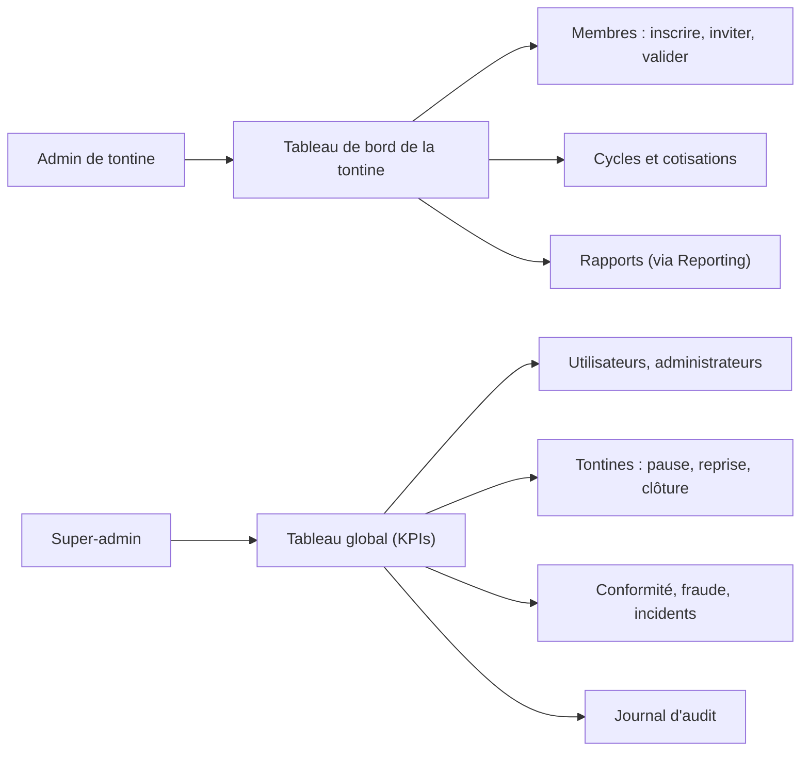

# Parcours utilisateurs (user flow)

Parcours principal du prompt de conception, aligné sur les spécifications (source de vérité,
`docs/specs/TontineMoney_UserStories_Detaillees.md`) : l'inscription est une **demande de compte
validée par un administrateur** (US-1.3), puis l'activation par code (OTP, 15 min) et le choix du
mot de passe (A-56). CTA : libellés officiels du prompt ; un seul bouton principal (or) par écran.

## 1. Parcours principal (membre)

```mermaid
flowchart TD
  W["Bienvenue<br/>« Épargnez ensemble, en toute confiance »"] -->|Créer mon compte| I
  W -->|Se connecter| L
  I["Inscription<br/>nom, prénom, téléphone, e-mail,<br/>code d'invitation (optionnel)"] -->|Continuer| P["Demande envoyée<br/>« en cours de validation »"]
  P -. validation par l'admin (US-10.1) .-> O
  O["OTP<br/>6 chiffres, minuteur 15 min"] -->|Valider le code| MDP["Création du mot de passe"]
  O -->|Renvoyer le code| O
  O -. code invalide / expiré .-> O
  MDP -->|Continuer| K["KYC<br/>statut : vérification requise"]
  K -->|Envoyer mes documents| KC["KYC en cours"]
  KC -. validé .-> T{"Tontine"}
  KC -. rejeté (motif) .-> K
  T -->|Créer la tontine| CW["Assistant 4 étapes"]
  T -->|Accepter une invitation| TA["Adhésion"]
  CW --> D["Tableau de bord"]
  TA --> D
  D -->|Payer ma contribution| C["Contribution<br/>solde avant paiement, confirmation"]
  C --> D
  D -. mon tour .-> R["Réception du pot<br/>notification + wallet crédité"]
  R --> WL["Wallet"]
  WL -->|Ajouter de l'argent| DEP["Dépôt"]
  WL -->|Retirer mes fonds| RET["Retrait<br/>OTP de sécurité"]
  L["Connexion<br/>e-mail ou téléphone, mot de passe"] -->|Se connecter| MFA{"MFA ?"}
  MFA -- non --> D
  MFA -- oui --> OTPL["Code de vérification"] --> D
```

## 2. Flux secondaires

| Flux                | Étapes                                                                                                         | États à couvrir                                   |
| ------------------- | -------------------------------------------------------------------------------------------------------------- | ------------------------------------------------- |
| Dépôt               | Montant → mode de paiement (Mobile Money, carte) → confirmation → attente PSP → crédit                         | chargement, refus PSP, délai dépassé, succès      |
| Retrait             | Montant (≤ solde disponible) → compte destination → **OTP de sécurité** → envoi                                | solde insuffisant, OTP invalide, en cours, succès |
| Contribution        | Montant dû (+ pénalité) → **solde avant paiement** → confirmation → « Paiement en cours » (saga, A-53) → payée | solde insuffisant, échec (motif), succès          |
| KYC                 | Statut → pièce (recto, verso) → selfie (caméra ou galerie) → envoi → revue                                     | vérification requise, en cours, validé, rejeté    |
| Création de tontine | Type → montant, devise, fréquence → règles → invitations → créer                                               | brouillon, erreurs de validation, succès          |
| Invitation          | Lien ou code → aperçu de la tontine → accepter / refuser                                                       | invitation expirée, KYC requis                    |
| Notifications       | Liste → filtre (Paiement, Rappel, Système, KYC, Wallet) → voir / marquer comme lu                              | vide, erreur                                      |
| Mot de passe oublié | Identifiant → lien ou code → nouveau mot de passe                                                              | lien expiré                                       |

## 3. Administration



## 4. Règles transverses

- Afficher le **solde avant tout paiement**, le **statut avant toute action**, une **confirmation**
  pour toute action irréversible (clôture, suppression, retrait).
- Chaque écran couvre les états **chargement, vide, erreur, succès**.
- Langage simple, montants en graisse 500 suivis de la devise en texte secondaire.
